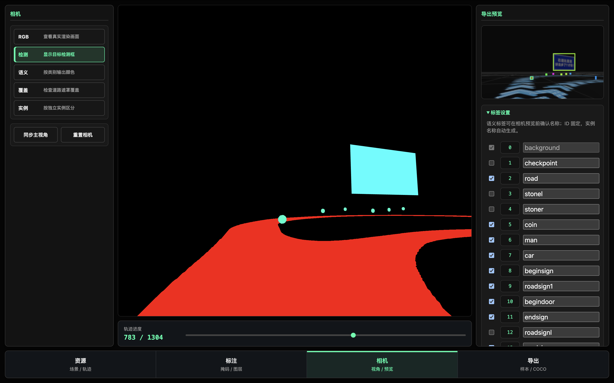

# XSmart_Car_MiscTools - AutoDataLabeling

这是一个基于 Web 的智能车赛道 3D 数据可视化与自动标注工具。项目利用 Three.js 构建 3D 渲染管线，实现了赛道场景 ZIP 导入、多圈数元素过滤、车辆轨迹随动模拟、像素级精准包围盒提取，以及一键导出符合标准深度学习训练格式（COCO 标注、语义/实例分割掩码、相机参数）的数据集。



---

## 核心功能

1. **场景与程序分离**
   支持一键导入包含 3D 资源（如 `models/` 中的 GLB 模型）、场景配置文件（`objects.json`）和地面底图的 ZIP 压缩包，实现场景资产的动态热加载。

2. **多圈数资源过滤与自动显隐 (Lap Filtering)**
   轨迹播放时能根据小车当前的极坐标圈数（Lap），自动控制当前圈数下金币、障碍物等 3D 元素的可见性，保证标注数据与车辆实际所处圈数环境精确对应。

3. **常驻底图与缺失缓存机制**
   底图（`map.png`）在任何渲染模式和圈数下常驻显示。如果导入的场景 ZIP 包中没有包含底图，系统会自动 Ajax 回退并复用本地缓存的默认地图，确保渲染绝不黑屏。

4. **车辆轨迹随动与水平视角锁定**
   支持导入 `track.txt` 车辆物理轨迹（含 X、Z 坐标与偏航角 Yaw）。播放时，相机的俯仰角 (Pitch) 和翻滚角 (Roll) 强制锁定为水平 $0^\circ$，使相机视线与车辆行进方向完美对齐，清空轨迹后自动复位。

5. **单通像素级包围盒解算 (Single-pass Pixel-perfect Sweeper)**
   * **超高性能**：采用全场景单通（Single-pass） `instance` 变体渲染，将所有模型以不重复的 24 位 ID 颜色涂色后，在 CPU 端进行 JIT 级别的高速扁平扫描，支持 **60+ FPS** 的实时无卡顿滑块拖拽。
   * **像素级相切**：检测框完全依赖实际可见的渲染像素生成，能自动过滤并忽略模型底部的隐形阴影平面（如 `car.glb` 的 Shadow Plane）或车顶多余的线框，使边界框严密和小车外缘相切。
   * **遮挡与裁剪感知**：天然集成 WebGL 深度检测与视锥体截断，被墙壁挡住的部分或超出屏幕的部分会自动收缩或剔除。

6. **一键导出数据集**
   支持一键生成并下载包含以下内容的 ZIP 样本包：
   * `rgb.png`：标准相机视野图。
   * `semantic_mask.png`：类别的语义分割图。
   * `semantic_road_covered_mask.png`：路面覆盖语义分割图。
   * `instance_mask.png`：实例分割掩码图。
   * `labels.json`：符合 COCO 格式的检测框标注信息。
   * `camera.json`：相机的 AR 物理坐标与欧拉角姿态。

---

## 项目结构

```text
XSmart_Car_MiscTools/
├── README.md                          # 项目说明文件
└── AutoDataLabeling/                  # 自动数据标注工具根目录
    ├── index.html                     # Web 主页面入口
    ├── map.png                        # 默认缓存地面底图
    ├── track.txt                      # 默认车辆轨迹数据
    ├── fliter.py                      # 辅助过滤 Python 脚本
    ├── styles/
    │   └── main.css                   # 页面样式表
    ├── js/
    │   ├── app.js                     # 核心启动、解包与生命周期调度
    │   ├── state.js                   # 全局状态管理与默认配置
    │   ├── scene.js                   # Three.js 场景构建、材质变体与图层UI
    │   ├── pose-track.js              # 轨迹解析、随动逻辑与视角同步
    │   ├── export.js                  # 离屏渲染、单通扫描、标签序列化与压缩打包
    │   └── ui.js                      # DOM 交互绑定与 2D Canvas 检测框渲染
    └── tests/                         # 测试用例目录
```

---

## 快速开始

本项目为纯前端应用，涉及使用 JSZip 进行本地客户端解包、Three.js 跨域加载 Blob 资源等，因此**必须在 Web 服务器环境**下运行，以规避浏览器的跨域安全限制（CORS）。

### 方法一：使用 VS Code Live Server 插件（推荐）
1. 使用 VS Code 打开 `XSmart_Car_MiscTools` (或 `XSmart_Car_AutoDataLabeling`) 文件夹。
2. 在 VS Code 插件市场搜索并安装 **Live Server** 插件。
3. 在左侧文件树中右键点击 `index.html`，选择 **Open with Live Server**。
4. 浏览器会自动打开 `http://127.0.0.1:5500/index.html`。

### 方法二：使用 Python 快速启动本地服务器
在项目根目录（含有 `index.html` 的目录下）打开终端，运行：
```bash
# Python 3
python3 -m http.server 8000
```
然后在浏览器中访问 `http://localhost:8000` 即可。

---

## 详细使用步骤与说明

为了顺利生成深度学习数据集，请按照以下步骤操作：

### 第一步：准备并导入场景资产 (Import 3D Scene Asset)
1. **构建场景 ZIP 压缩包**：
   系统通过解压缩客户端加载场景，请准备一个 ZIP 格式的压缩文件，其内部结构要求如下：
   - **`objects.json`**（必须）：场景配置文件，声明了场景中所有物体的空间参数、模型引用名、唯一实例 ID 以及圈数（Lap）等元数据。
   - **`models/` 文件夹**（必须）：存放 3D 模型文件。所有模型格式均要求为 `.glb`。例如 `car.glb` (车辆)、`cone.glb` (锥桶)、`coin.glb` (金币) 等，需与 `objects.json` 中声明的路径保持一致。
   - **`map.png`**（可选）：赛道的地面底图贴图。如果在 ZIP 包内未提供此文件，系统将回退并自动加载根目录下的默认 `map.png`。
2. **导入并解析**：
   - 访问系统首页，将准备好的场景 ZIP 压缩包拖入界面的**拖拽区 (Dropzone)**，或者点击 **“点击浏览文件”** 选择该 ZIP 包。
   - 确认文件信息无误后，点击 **“导入并解析场景”** 按钮。系统会在后台自动完成解包、缓存 Blobs 并初始化 3D 渲染画布。

### 第二步：上传与校准底图 (Upload & Calibrate Ground Map)
1. **上传/覆盖底图（可选）**：
   - 点击下方工作流程导航栏切换至 **“资源”** 选项卡。
   - 在左侧栏的 **“地面底图 (map.png)”** 面板中，可以点击 **“上传自定义底图”** 并选择本地的 PNG/JPG 文件，以实时覆盖当前的赛道地面底图。系统会自动应用该底图并重新生成道路遮罩掩码。
   - 点击 **“恢复默认底图”** 可以随时撤销上传，还原为 ZIP 内置的底图（如果未包含，则还原为系统自带的默认 `map.png`）。
2. **物理位置校准（可选）**：
   - 在左侧栏的 **“底图物理校准”** 折叠面板下调节滑块：
     - **底图物理宽度 (Width) / 高度 (Height)**：微调底图对应的物理世界实际尺寸（单位：米）。
     - **中心位置 X (CenterX) / Z (CenterZ)**：偏移底图的位置，使其与 3D 围栏、模型物理边界完美重合。

### 第三步：导入车辆行驶轨迹 (Import Pose Trajectory)
1. 在左侧栏的 **“资源”** 选项卡下，点击 **“导入轨迹文件”**。
2. 选择物理轨迹文本文件（如根目录下的 track.txt。
3. **数据格式规范**：轨迹文本的每一行必须为如下格式（支持带毫秒的时间戳，坐标单位为毫米）：
   ```text
   [YYYY-MM-DD HH:MM:SS.mmm] x_mm=<X偏移> y_mm=<Y偏移> yaw_deg=<偏航角>
   ```
   *示例：`[2026-06-14 08:15:58.944] x_mm=315.0 y_mm=1077.5 yaw_deg=171.7`*
   *注意：系统解析时，会自动将毫米换算为 Three.js 的米，并自动修正车辆偏航角映射关系。*
4. 导入成功后，底部时间轴滑块将启用，显示小车当前位置和总帧数，且主视窗中将显示红色定位球标记。

### 第四步：检查并微调标签设置 (Label Settings)
1. 点击下方导航栏切换至 **“相机”** 选项卡。
2. 此时，**“标签设置”** 会移至左侧栏并**默认展开**：
   - **语义标签编辑器 (Semantic Label Editor)**：
     - 这里列出了当前场景中所有的语义类别（如 `road`、`cone`、`car` 等）。
     - 勾选复选框可以控制该类别是否参与渲染和导出。
     - 可以在输入框中直接修改该类别的语义别名（例如将 `cone` 改为 `traffic_cone`），修改将实时同步并应用到导出的 COCO 数据集中。
   - **实例命名预览 (Instance Naming)**：
     - 文本框中会列出当前场景中所有具体实例的 ID、自动生成的实例名及所属类别的映射（形如 `1: car_1 -> car`）。

### 第五步：标注检查与视角微调 (Annotate & Camera Adjustments)
1. **时序回放**：拖动底部的**“轨迹进度”**滑块。随着滑块拖动，相机将自动跟随车辆，并强制锁定 Roll/Pitch 为 0 保持水平视角。
2. **掩码与图层显隐**：
   - 切换到 **“标注”** 选项卡。
   - 勾选 **“开启标注掩码模式”** 可以隐藏背景网格等无用辅助元素。
   - 在下方 **“模型独立可见性”** 列表中，点击物品旁边的眼球图标可以控制任意特定物体的显示与隐藏。
   - 还可以利用 **“圈数过滤显示”** 过滤不同圈数（Lap 0 ~ Lap 4）下的元素。
3. **导出视图切换**：
   - 切换到 **“相机”** 选项卡。
   - 在左侧栏的 **“相机”** 面板中，利用 `RGB`、`检测`、`语义`、`覆盖`、`实例` 按钮切换预览图像，检查标注边界框或分割掩码。
   - 可以在左侧/右侧面板调整相机的物理坐标、FOV 视场角。若想直接提取您在主 3D 画布中拖拽出的自由视角，点击 **“同步主视角”** 即可。
   - 在 **“画面设置”** 中选择比例预设（如 16:9）或输入自定义宽度和高度。

### 第六步：一键导出数据集 (Dataset Export)
1. 切换到下方导航栏的 **“导出”** 选项卡。
2. 在左侧栏的 **“Sample Name”** 中输入数据集的前缀名。
3. 在右侧面板中，根据需要选择以下三种导出方式之一：
   - **导出当前样本 ZIP**：仅渲染并打包当前帧下的数据集。
   - **导出整段轨迹 ZIP**：自动遍历整条轨迹中的所有帧，进行离屏同步渲染，并打包成包含完整帧序列的多模态数据集 ZIP。
   - **导出 COCO 检测 ZIP**：专门导出含有标准 COCO json 目标检测格式的文件包。
4. 导出就绪后，系统会自动打包并调起浏览器的文件下载，解压即可用于后续深度学习训练。

